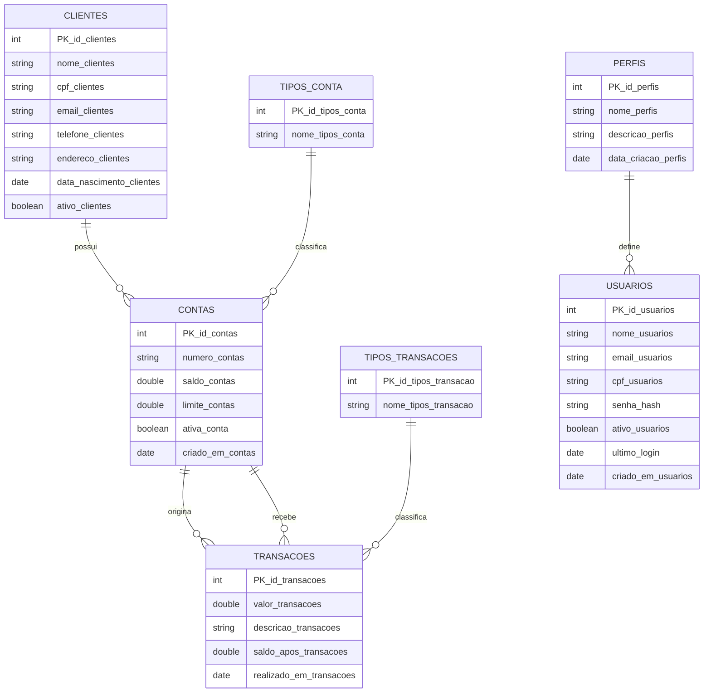

# 🏦 GMS Bank System

> Sistema web de gerenciamento bancário desenvolvido com Spring Boot e Thymeleaf.

---

## 📋 Sobre o Projeto

O **GMS Bank** é um projeto acadêmico desenvolvido em Java com Spring Boot que simula o funcionamento de um sistema bancário interno. Permite o gerenciamento completo de **clientes**, **contas**, **transações** e **usuários**, com interface web responsiva e autenticação via Spring Security.

---

## 🏗️ Diagrama de Entidades



---

## 📁 Estrutura do Projeto

```
gms-bank/
├── src/
│   └── main/
│       ├── java/com/gmsbank/
│       │   ├── config/
│       │   │   └── SecurityConfig.java
│       │   ├── controller/
│       │   │   ├── ClienteController.java
│       │   │   ├── ContaController.java
│       │   │   ├── DashboardController.java
│       │   │   ├── RelatorioController.java
│       │   │   ├── TransacaoController.java
│       │   │   └── UsuarioController.java
│       │   ├── DB/
│       │   │   └── BancoDeDados.md
│       │   ├── model/
│       │   │   ├── Clientes.java
│       │   │   ├── Contas.java
│       │   │   ├── Perfis.java
│       │   │   ├── TiposConta.java
│       │   │   ├── TiposTransacoes.java
│       │   │   ├── Transacoes.java
│       │   │   └── Usuarios.java
│       │   ├── repository/
│       │   │   ├── ClientesRepository.java
│       │   │   ├── ContasRepository.java
│       │   │   ├── PerfisRepository.java
│       │   │   ├── TiposContaRepository.java
│       │   │   ├── TiposTransacoesRepository.java
│       │   │   ├── TransacoesRepository.java
│       │   │   └── UsuarioRepository.java
│       │   ├── service/
│       │   │   └── AuthService.java
│       │   └── GmsBankApplication.java
│       └── resources/
│           ├── templates/
│           │   ├── clientes.html
│           │   ├── clientesContas.html
│           │   ├── contas.html
│           │   ├── dashboard.html
│           │   ├── editarClientes.html
│           │   ├── login.html
│           │   ├── relatorios.html
│           │   ├── transacoes.html
│           │   └── usuarios.html
│           └── application.properties
```

---

## 🧩 Controllers

### `DashboardController`
Ponto de entrada da aplicação. Exibe KPIs gerais e transações recentes.

| Rota | Método | Descrição |
|---|---|---|
| `/` | GET | Redireciona para o dashboard |
| `/dashboard` | GET | Exibe totais de clientes, contas e transações |

---

### `ClienteController`
Gerenciamento completo de clientes.

| Rota | Método | Descrição |
|---|---|---|
| `/clientes` | GET | Lista todos os clientes |
| `/clientes/cadastrar` | POST | Cadastra novo cliente |
| `/clientes/editar/{id}` | GET | Exibe formulário de edição |
| `/clientes/editar/{id}` | POST | Salva alterações do cliente |
| `/clientes/deletar/{id}` | POST | Remove um cliente |
| `/clientes/contas` | GET | Lista clientes com suas contas |

---

### `ContaController`
Gerenciamento de contas bancárias.

| Rota | Método | Descrição |
|---|---|---|
| `/contas` | GET | Lista todas as contas |
| `/contas/cadastrar` | POST | Abre uma nova conta |
| `/contas/deletar/{id}` | POST | Encerra uma conta |

---

### `TransacaoController`
Processamento de movimentações financeiras com validação de saldo.

| Rota | Método | Descrição |
|---|---|---|
| `/transacoes` | GET | Lista o histórico de transações |
| `/transacoes/nova` | POST | Processa depósito, saque ou transferência |

---

### `UsuarioController`
Gerenciamento de usuários e perfis de acesso.

| Rota | Método | Descrição |
|---|---|---|
| `/usuarios` | GET | Lista todos os usuários |
| `/usuarios/cadastrar` | POST | Cadastra novo usuário |
| `/usuarios/editar/{id}` | GET | Exibe formulário de edição |
| `/usuarios/editar/{id}` | POST | Salva alterações do usuário |
| `/usuarios/deletar/{id}` | POST | Remove um usuário |

---

### `RelatorioController`
Visão consolidada das operações do banco.

| Rota | Método | Descrição |
|---|---|---|
| `/relatorios` | GET | Exibe KPIs, maiores saldos e histórico completo |

---

## ⚙️ Regras de Negócio

| Regra | Descrição |
|---|---|
| **Depósito** | Soma o valor diretamente ao saldo da conta |
| **Saque** | Valida saldo disponível (saldo + limite) antes de debitar |
| **Transferência** | Valida saldo na origem, debita origem e credita destino atomicamente |
| **Novo cliente** | Sempre cadastrado com status ativo |
| **Nova conta** | Sempre aberta com status ativa |
| **Novo usuário** | Sempre cadastrado com status ativo |

---

## 🛠️ Tecnologias


---

## 🚀 Como Executar

### Pré-requisitos

- Java JDK 17 ou superior
- Maven 3.8+
- MySQL 8.0+
- IntelliJ IDEA (recomendado)

### Passos

```bash
# Clone o repositório
git clone https://github.com/seu-usuario/gms-bank.git

# Acesse a pasta do projeto
cd gms-bank
```

Configure o banco de dados em `src/main/resources/application.properties`:

```properties
spring.datasource.url=jdbc:mysql://localhost:3306/gmsbank
spring.datasource.username=seu_usuario
spring.datasource.password=sua_senha
spring.jpa.hibernate.ddl-auto=update
```

```bash
# Compile e execute com Maven
mvn spring-boot:run
```


---

## 🎬 Vídeo Demonstrativo

📺 **Assista ao vídeo demonstrativo:**
👉 [Clique aqui para assistir](https://drive.google.com/file/d/1Ej2TdXDungz4C4JLztcs6xq0xc5jbR5N/view?usp=sharing)

---
