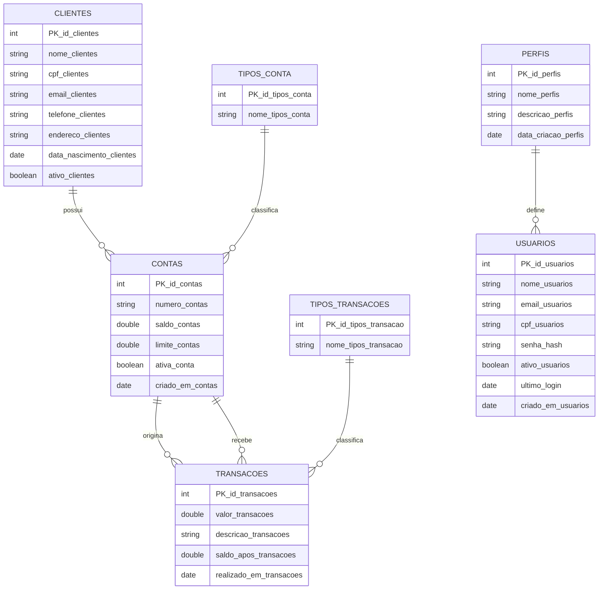

# 🏦 GMS Bank System

> Sistema web de gerenciamento bancário desenvolvido com Spring Boot e Thymeleaf.

---

## 📋 Sobre o Projeto

O **GMS Bank** é um projeto acadêmico desenvolvido em Java com Spring Boot que simula o funcionamento de um sistema bancário interno. Permite o gerenciamento completo de **clientes**, **contas**, **transações** e **usuários**, com interface web responsiva e autenticação via Spring Security.

---

## 🏗️ Diagrama de Entidades


```mermaid
erDiagram
    CLIENTES {
        int PK_id_clientes
        string nome_clientes
        string cpf_clientes
        string email_clientes
        string telefone_clientes
        string endereco_clientes
        date data_nascimento_clientes
        boolean ativo_clientes
    }
    CONTAS {
        int PK_id_contas
        string numero_contas
        double saldo_contas
        double limite_contas
        boolean ativa_conta
        date criado_em_contas
    }
    TIPOS_CONTA {
        int PK_id_tipos_conta
        string nome_tipos_conta
    }
    TRANSACOES {
        int PK_id_transacoes
        double valor_transacoes
        string descricao_transacoes
        double saldo_apos_transacoes
        date realizado_em_transacoes
    }
    TIPOS_TRANSACOES {
        int PK_id_tipos_transacao
        string nome_tipos_transacao
    }
    USUARIOS {
        int PK_id_usuarios
        string nome_usuarios
        string email_usuarios
        string cpf_usuarios
        string senha_hash
        boolean ativo_usuarios
        date ultimo_login
        date criado_em_usuarios
    }
    PERFIS {
        int PK_id_perfis
        string nome_perfis
        string descricao_perfis
        date data_criacao_perfis
    }

    CLIENTES ||--o{ CONTAS : possui
    TIPOS_CONTA ||--o{ CONTAS : classifica
    CONTAS ||--o{ TRANSACOES : origina
    CONTAS ||--o{ TRANSACOES : recebe
    TIPOS_TRANSACOES ||--o{ TRANSACOES : classifica
    PERFIS ||--o{ USUARIOS : define
```

---

## 📁 Estrutura do Projeto

```
gms-bank/
├── src/
│   └── main/
│       ├── java/com/gmsbank/
│       │   ├── config/
│       │   │   └── SecurityConfig.java
│       │   ├── controller/
│       │   │   ├── ClienteController.java
│       │   │   ├── ContaController.java
│       │   │   ├── DashboardController.java
│       │   │   ├── RelatorioController.java
│       │   │   ├── TransacaoController.java
│       │   │   └── UsuarioController.java
│       │   ├── DB/
│       │   │   └── BancoDeDados.md
│       │   ├── model/
│       │   │   ├── Clientes.java
│       │   │   ├── Contas.java
│       │   │   ├── Perfis.java
│       │   │   ├── TiposConta.java
│       │   │   ├── TiposTransacoes.java
│       │   │   ├── Transacoes.java
│       │   │   └── Usuarios.java
│       │   ├── repository/
│       │   │   ├── ClientesRepository.java
│       │   │   ├── ContasRepository.java
│       │   │   ├── PerfisRepository.java
│       │   │   ├── TiposContaRepository.java
│       │   │   ├── TiposTransacoesRepository.java
│       │   │   ├── TransacoesRepository.java
│       │   │   └── UsuarioRepository.java
│       │   ├── service/
│       │   │   └── AuthService.java
│       │   └── GmsBankApplication.java
│       └── resources/
│           ├── templates/
│           │   ├── clientes.html
│           │   ├── clientesContas.html
│           │   ├── contas.html
│           │   ├── dashboard.html
│           │   ├── editarClientes.html
│           │   ├── login.html
│           │   ├── relatorios.html
│           │   ├── transacoes.html
│           │   └── usuarios.html
│           └── application.properties
├── Dockerfile
├── docker-compose.yaml
├── .env.example
└── .gitignore
```

---

## 🧩 Controllers

### `DashboardController`
Ponto de entrada da aplicação. Exibe KPIs gerais e transações recentes.

| Rota | Método | Descrição |
|---|---|---|
| `/` | GET | Redireciona para o dashboard |
| `/dashboard` | GET | Exibe totais de clientes, contas e transações |

---

### `ClienteController`
Gerenciamento completo de clientes.

| Rota | Método | Descrição |
|---|---|---|
| `/clientes` | GET | Lista todos os clientes |
| `/clientes/cadastrar` | POST | Cadastra novo cliente |
| `/clientes/editar/{id}` | GET | Exibe formulário de edição |
| `/clientes/editar/{id}` | POST | Salva alterações do cliente |
| `/clientes/deletar/{id}` | POST | Remove um cliente |
| `/clientes/contas` | GET | Lista clientes com suas contas |

---

### `ContaController`
Gerenciamento de contas bancárias.

| Rota | Método | Descrição |
|---|---|---|
| `/contas` | GET | Lista todas as contas |
| `/contas/cadastrar` | POST | Abre uma nova conta |
| `/contas/deletar/{id}` | POST | Encerra uma conta |

---

### `TransacaoController`
Processamento de movimentações financeiras com validação de saldo.

| Rota | Método | Descrição |
|---|---|---|
| `/transacoes` | GET | Lista o histórico de transações |
| `/transacoes/nova` | POST | Processa depósito, saque ou transferência |

---

### `UsuarioController`
Gerenciamento de usuários e perfis de acesso.

| Rota | Método | Descrição |
|---|---|---|
| `/usuarios` | GET | Lista todos os usuários |
| `/usuarios/cadastrar` | POST | Cadastra novo usuário |
| `/usuarios/editar/{id}` | GET | Exibe formulário de edição |
| `/usuarios/editar/{id}` | POST | Salva alterações do usuário |
| `/usuarios/deletar/{id}` | POST | Remove um usuário |

---

### `RelatorioController`
Visão consolidada das operações do banco.

| Rota | Método | Descrição |
|---|---|---|
| `/relatorios` | GET | Exibe KPIs, maiores saldos e histórico completo |

---

## ⚙️ Regras de Negócio

| Regra | Descrição |
|---|---|
| **Depósito** | Soma o valor diretamente ao saldo da conta |
| **Saque** | Valida saldo disponível (saldo + limite) antes de debitar |
| **Transferência** | Valida saldo na origem, debita origem e credita destino atomicamente |
| **Novo cliente** | Sempre cadastrado com status ativo |
| **Nova conta** | Sempre aberta com status ativa |
| **Novo usuário** | Sempre cadastrado com status ativo |

---

## 🛠️ Tecnologias


---

## 🚀 Como Executar

O projeto está totalmente containerizado com **Docker**. Não é necessário instalar Java, Maven ou PostgreSQL na máquina — só o Docker.

### Pré-requisitos

- [Docker](https://www.docker.com/) e Docker Compose instalados

### Passos

```bash
# Clone o repositório
git clone https://github.com/seu-usuario/gms-bank.git

# Acesse a pasta do projeto
cd gms-bank
```

Copie o arquivo de variáveis de ambiente de exemplo e edite com suas próprias credenciais locais:

```bash
cp .env.example .env
```

O `.env.example` já vem com a estrutura esperada:

```
POSTGRES_DB=fincore_db
POSTGRES_USER=postgres
POSTGRES_PASSWORD=defina_uma_senha_aqui
```

> ⚠️ **Aviso:** o arquivo `.env` contém a senha do banco e **não é versionado** (está no `.gitignore`). Cada pessoa que clonar o projeto deve criar o seu próprio `.env` local a partir do `.env.example` — nunca commitar o `.env` real.

Suba os containers (aplicação + banco de dados):

```bash
docker compose up --build
```

Isso vai:
1. Compilar o projeto com Maven dentro do container
2. Subir o PostgreSQL e aguardar ele ficar saudável (healthcheck)
3. Iniciar a aplicação Spring Boot conectada ao banco

### Portas

| Serviço | Porta interna | Porta exposta na máquina |
|---|---|---|
| Aplicação (Spring Boot) | `8081` | `8081` |
| PostgreSQL | `5432` | `5433` |

Acesse a aplicação em: **http://localhost:8081**

> Se a porta `8081` ou `5433` já estiver em uso na sua máquina, edite o `docker-compose.yaml` trocando apenas o primeiro número de cada mapeamento (ex: `"5433:5432"` → `"5434:5432"`), sem alterar a porta interna do container.

Para derrubar os containers (mantendo os dados salvos no volume):

```bash
docker compose down
```

---

## 🎬 Vídeo Demonstrativo

📺 **Assista ao vídeo demonstrativo:**
👉 [Clique aqui para assistir](https://drive.google.com/file/d/1Ej2TdXDungz4C4JLztcs6xq0xc5jbR5N/view?usp=sharing)

---