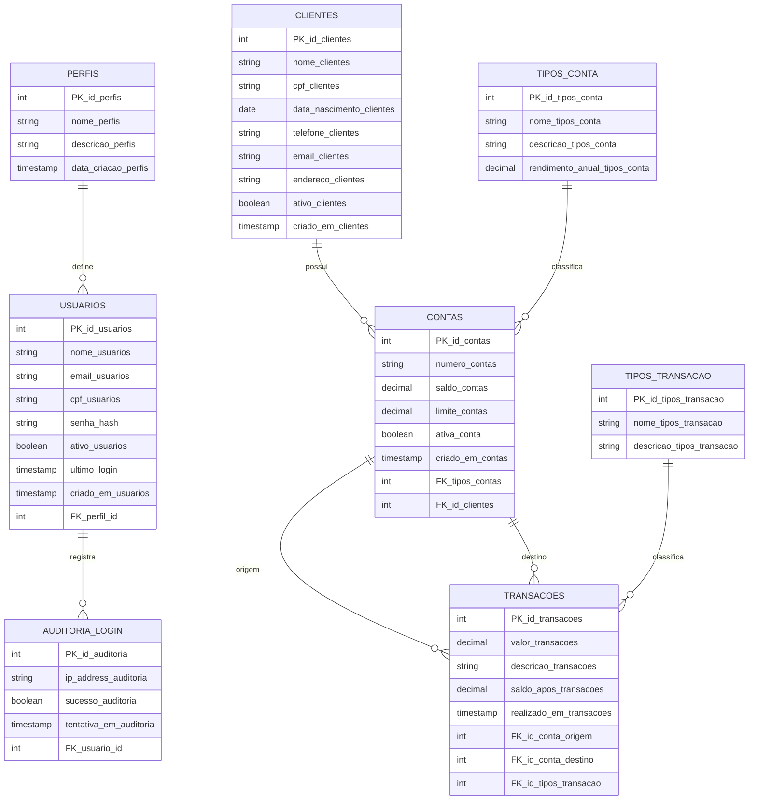

# 🏦 GMS Bank System

> Sistema web de gerenciamento bancário desenvolvido com Spring Boot, Thymeleaf e PostgreSQL.

---

## 📋 Sobre o Projeto

O **GMS Bank** é um projeto acadêmico desenvolvido em Java com Spring Boot que simula o funcionamento de um sistema bancário interno. Permite o gerenciamento completo de **clientes**, **contas**, **transações** e **usuários**, com interface web responsiva e autenticação via Spring Security.

---

## Tabelas Banco de Dados


* 👤 Clientes
* 💳 Contas
* 💸 Transações
* 🔐 Usuários e Perfis
* 📊 Auditoria de Login

---

## 🧠 Diagrama de Entidades (Banco de Dados)



---

## 🐘 Banco de Dados

Este projeto utiliza **PostgreSQL** como sistema de gerenciamento de banco de dados.


---

# 📦 Scripts SQL

---

## 🏗️ DDL (Data Definition Language)

### 📁 Perfis

```sql
CREATE TABLE perfis (
                        PK_id_perfis SERIAL PRIMARY KEY,
                        nome_perfis VARCHAR(250) NOT NULL UNIQUE,
                        descricao_perfis VARCHAR(300),
                        data_criacao_perfis TIMESTAMP DEFAULT CURRENT_TIMESTAMP
);
```

---

### 📁 Usuários

```sql
CREATE TABLE usuarios (
                          PK_id_usuarios SERIAL PRIMARY KEY,
                          nome_usuarios VARCHAR(100) NOT NULL,
                          email_usuarios VARCHAR(100) NOT NULL UNIQUE,
                          cpf_usuarios VARCHAR(14) NOT NULL UNIQUE,
                          senha_hash VARCHAR(255) NOT NULL,
                          ativo_usuarios BOOLEAN DEFAULT TRUE,
                          ultimo_login TIMESTAMP DEFAULT CURRENT_TIMESTAMP,
                          criado_em_usuarios TIMESTAMP DEFAULT CURRENT_TIMESTAMP,
                          FK_perfil_id INT NOT NULL REFERENCES perfis (PK_id_perfis)
);
```

---

### 📁 Auditoria de Login

```sql
CREATE TABLE auditoria_login (
                                 PK_id_auditoria SERIAL PRIMARY KEY,
                                 ip_address_auditoria VARCHAR(45),
                                 sucesso_auditoria BOOLEAN NOT NULL,
                                 tentativa_em_auditoria TIMESTAMP DEFAULT CURRENT_TIMESTAMP,
                                 FK_usuario_id INT REFERENCES usuarios(PK_id_usuarios)
);
```

---

### 📁 Clientes

```sql
CREATE TABLE clientes (
                          PK_id_clientes SERIAL PRIMARY KEY,
                          nome_clientes VARCHAR(100) NOT NULL,
                          cpf_clientes VARCHAR(14) NOT NULL UNIQUE,
                          data_nascimento_clientes DATE NOT NULL,
                          telefone_clientes VARCHAR(20),
                          email_clientes VARCHAR(100) UNIQUE,
                          endereco_clientes TEXT,
                          ativo_clientes BOOLEAN DEFAULT TRUE,
                          criado_em_clientes TIMESTAMP DEFAULT CURRENT_TIMESTAMP
);
```

---

### 📁 Tipos de Conta

```sql
CREATE TABLE tipos_conta (
                             PK_id_tipos_conta SERIAL PRIMARY KEY,
                             nome_tipos_conta VARCHAR(50) NOT NULL UNIQUE,
                             descricao_tipos_conta TEXT,
                             rendimento_anual_tipos_conta NUMERIC(10,2) DEFAULT 0.00
);
```

---

### 📁 Contas

```sql
CREATE TABLE contas (
                        PK_id_contas SERIAL PRIMARY KEY,
                        numero_contas VARCHAR(20) NOT NULL UNIQUE,
                        saldo_contas DECIMAL(10,2) DEFAULT 0.00,
                        limite_contas DECIMAL(10,2) DEFAULT 0.00,
                        ativa_conta BOOLEAN DEFAULT TRUE,
                        criado_em_contas TIMESTAMP DEFAULT CURRENT_TIMESTAMP,
                        FK_tipos_contas INT NOT NULL REFERENCES tipos_conta(PK_id_tipos_conta),
                        FK_id_clientes INT NOT NULL REFERENCES clientes(PK_id_clientes)
);
```

---

### 📁 Tipos de Transação

```sql
CREATE TABLE tipos_transacao (
                                 PK_id_tipos_transacao SERIAL PRIMARY KEY,
                                 nome_tipos_transacao VARCHAR(50) NOT NULL UNIQUE,
                                 descricao_tipos_transacao TEXT
);
```

---

### 📁 Transações

```sql
CREATE TABLE transacoes (
                            PK_id_transacoes SERIAL PRIMARY KEY,
                            valor_transacoes DECIMAL(10,2) NOT NULL CHECK (valor_transacoes > 0),
                            descricao_transacoes TEXT,
                            saldo_apos_transacoes DECIMAL(10,2) NOT NULL,
                            realizado_em_transacoes TIMESTAMP DEFAULT CURRENT_TIMESTAMP,
                            FK_id_conta_origem INT NOT NULL REFERENCES contas(PK_id_contas),
                            FK_id_conta_destino INT REFERENCES contas(PK_id_contas),
                            FK_id_tipos_transacao INT NOT NULL REFERENCES tipos_transacao(PK_id_tipos_transacao)
);
```

---

## ✏️ DML (Data Manipulation Language)

### 📁 Perfis

```sql
INSERT INTO perfis (nome_perfis, descricao_perfis) VALUES ('ADMIN','Acesso total ao sistema');
INSERT INTO perfis (nome_perfis, descricao_perfis) VALUES ('GERENTE','Acesso gerencial ao sistema');
INSERT INTO perfis (nome_perfis, descricao_perfis) VALUES ('CAIXA','Acesso operacional basico ao sistema');
```

---

### 📁 Usuários

```sql
INSERT INTO usuarios (nome_usuarios, email_usuarios, cpf_usuarios, senha_hash, FK_perfil_id)
VALUES ('Marcos Ribeiro', 'marcosribeiro1899@gmail.com', '025.556.565-45', 'senha123', 1);

INSERT INTO usuarios (nome_usuarios, email_usuarios, cpf_usuarios, senha_hash, FK_perfil_id)
VALUES ('Arlyon José', 'arlyonjose1999@gmail.com', '156.597.459-12', 'senha123', 2);

UPDATE usuarios
SET senha_hash = 'e7d80ffeefa212b7c5c55700e4f7193e'
WHERE email_usuarios = 'marcosribeiro1899@gmail.com';
```

---

### 📁 Clientes

```sql
INSERT INTO clientes (nome_clientes, cpf_clientes, data_nascimento_clientes, telefone_clientes, email_clientes, endereco_clientes)
VALUES ('Carlos Gabriel', '044.034.743-22', '2006-07-20', '(86) 98816-6764', 'carlosgabrielmonteiro2006@gmail.com', 'Mocambinho');
```

---

### 📁 Tipos de Conta

```sql
INSERT INTO tipos_conta (nome_tipos_conta, descricao_tipos_conta, rendimento_anual_tipos_conta)
VALUES ('Conta Corrente', 'Uso diário', 0.00);
```

---

### 📁 Contas

```sql
INSERT INTO contas (numero_contas, saldo_contas, limite_contas, FK_tipos_contas, FK_id_clientes)
VALUES ('0001-1', 1000000.00, 99999999.00, 1, 1);
```

---

### 📁 Transações

```sql
INSERT INTO transacoes (valor_transacoes, descricao_transacoes, saldo_apos_transacoes, FK_id_conta_origem, FK_id_tipos_transacao)
VALUES (20.00, 'Deposito mensal', 1000020.00, 1, 2);

UPDATE transacoes SET saldo_apos_transacoes = 1000020.00 WHERE PK_id_transacoes = 1;
```

---

## 🔍 DQL (Data Query Language)

### 📁 Usuários

```sql
SELECT * FROM usuarios;
```

---

## 🔍 DQL (Consulta via JPA)

### 📁 Clientes + Contas (ClientesRepository)

```java
@Query(value = """
    SELECT c.nome_clientes, co.numero_contas, co.saldo_contas
    FROM clientes c
    INNER JOIN contas co ON c.PK_id_clientes = co.FK_id_clientes
""", nativeQuery = true)
List<Object[]> buscarClientesComContas();
```

---

### 📊 Descrição da Query

Consulta responsável por listar os clientes juntamente com suas contas bancárias.

**Dados retornados:**

* 👤 Nome do cliente (`nome_clientes`)
* 💳 Número da conta (`numero_contas`)
* 💰 Saldo da conta (`saldo_contas`)

---

### 🔗 Relacionamento utilizado

* `clientes` → `contas` (1:N)

---

### 📦 Tipo de retorno

```java
List<Object[]>
```

---

### 🧩 Estrutura do resultado
